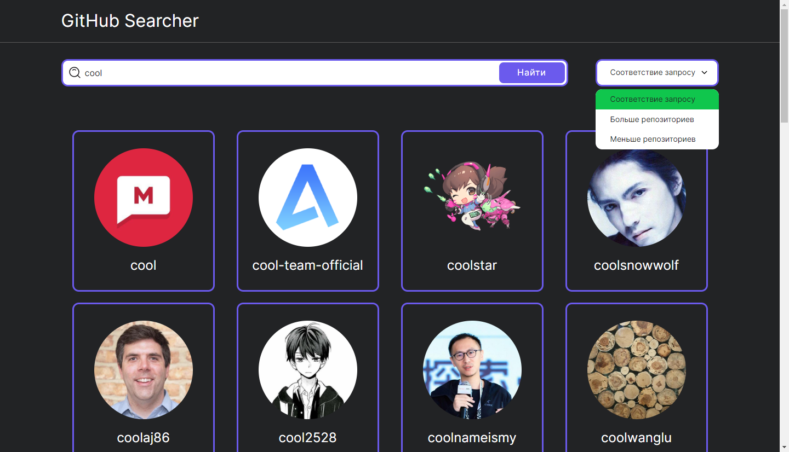
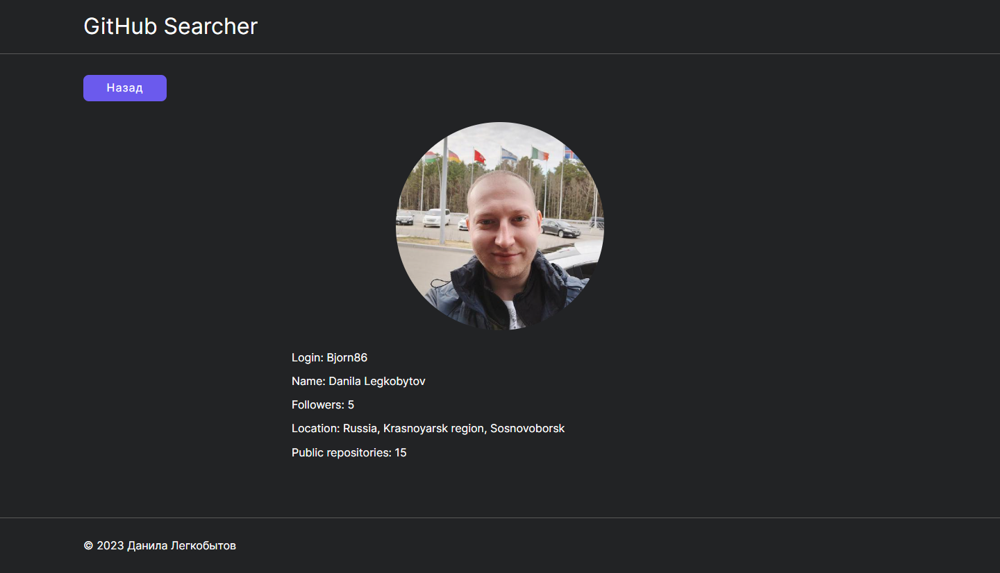

# Тестовое задание: Skyeng

Тестовое задание от сервиса [Skyeng](https://skyeng.ru/)

## Оглавление

- [Обзор проекта](#обзор-проекта)
  - [Задачи проекта](#задачи-проекта)
  - [Функциональность проекта](#функциональность-проекта)
  - [Screenshot](#screenshot)
  - [Директории проекта](#директории-проекта)
  - [Запуск проекта](#запуск-проекта)
  - [Ссылки](#ссылки)
- [Ход выполнения проекта](#ход-выполнения-проекта)
  - [Используемые технологии](#используемые-технологии)
  - [Чему я научился работая над проектом](#чему-я-научился-работая-над-проектом)
- [Автор](#автор)

## Обзор проекта

### Задачи проекта

Создать web-приложение интегрированное с [GitHub REST API](https://docs.github.com/en/rest?apiVersion=2022-11-28), с помощью которого можно производить поиск пользователей GitHub.

### Функциональность проекта

Функционально проект представляет из себя SPA позволяющие производить поиск и сортировку пользователей GitHub.

Функциональность:

- Поиск пользователя по логину
- Сортировка пользователей по соответствию запросу, по количеству репозиториев (возрастание/убывание)
- Просмотр детальной информации о профиле пользователя
- Пагинация запросов к REST API

### Screenshot

### Директории проекта

- `src/assets` — директория со статичными файлами
- `src/components` — директория с компонентами
- `src/lib` — директория с файлами библиотек
- `src/pages` — директория с корневыми файлами страниц
- `src/utils` — директория со вспомогательными утилитами

### Запуск проекта

- `npm run build` — запуск проекта в режиме продакшн, с формированием файлов подготовленных к деплою в директории `/build`
- `npm start` — запуск проекта в режиме разработки

### Ссылки

- [Ссылка на репозиторий проекта](https://github.com/Bjorn86/testing-skyeng)
- [Ссылка на демо-страницу проекта](https://bjorn86.github.io/testing-skyeng/)

## Ход выполнения проекта

### Используемые технологии

- HTML
- CSS
- JS
- [React](https://react.dev/)
- [React Router](https://reactrouter.com/en/main)
- Адаптивная вёрстка
- Семантическая вёрстка

### Чему я научился работая над проектом

- Закрепил знания по React

## Автор

**Данила Легкобытов**

- e-mail: [legkobytov-danila@yandex.ru](mailto:legkobytov-danila@yandex.ru)
- Telegram: [@danila_legkobytov](https://t.me/danila_legkobytov)
- LinkedIn: [in/danila-legkobytov](https://www.linkedin.com/in/danila-legkobytov/)
